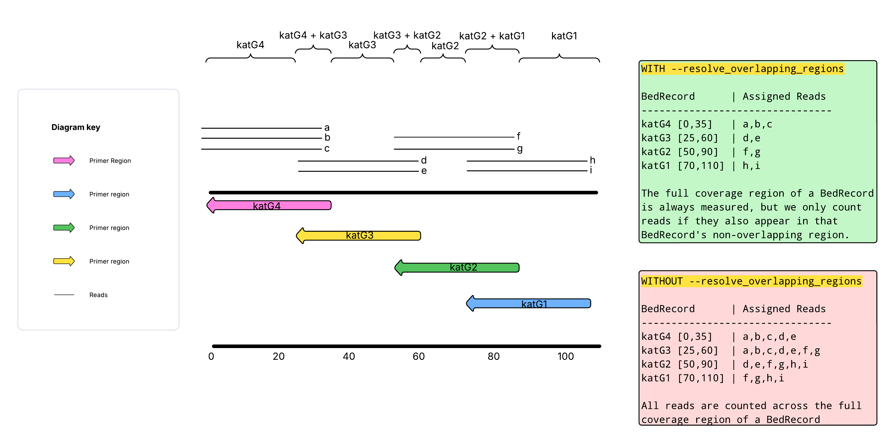

# Technical Code Breakdown

With the v3.0.0 refactor, `tbp-parser` has undergone significant changes and the previous technical description no longer applies. This document serves as a technical breakdown of the new code structure and algorithm used in `tbp-parser` v3.0.0+.

??? dna "Brief Class Descriptions"
    _In order of appearance_

    - `Configuration`: a singleton class that handles all configuration settings and input parameters for `tbp-parser`
    - `GeneDatabase`: a singleton class that contains information regarding each gene of interest; attributes include gene name, locus tag, tier, associated drugs, and promoter regions.
    - `LIMSGeneCode`: a class representing a gene-specific result for the LIMS report 
    - `LIMSRecord`: a class representing a drug-specific result for the LIMS report; contains a list of `LIMSGeneCode` objects (the genes associated with that drug)
    - `BedRecord`: a class representing a record/entry from a BED file; contains attributes such as chromosome, start, end, and gene name, It derives length and genomic coordinates.
    - `CoverageCalculator`: a class used to generate coverage statistics for BED records; contains methods to calculate percent coverage and average depth for a given BED record based on the read depth information from the BAM file
    - `BaseCoverage`: a base class to represent coverage data fora  genomic region that can be extended to represent coverage for specific types of regions.
    - `TargetCoverage`: a class to represent coverage data for a single target genomic region (BedRecord); based on the unique gene_name in the BedRecord. Multiple TargetCoveage objects may exist for a single locus_tag/gene if there are multiple BedRecords for the same locus_tag/gene.
    - `LocusCoverage`: a class to represent coverage data for a single locus tag, aggregating multiple target regions if necessary.
    - `ERRCoverage`: a class to represent coverage data for the essential reportable range (ERR) of a single target/locus
    - `VariantRecord`: a data class represnting a single variant record (aka JSON entry) from the TBProfiler JSON output
    - `VariantProcessor`: a class that processes VariantRecords into Variant objects
    - `Variant`: a class that represents a single genetic drug-gene-variant combination
    - `Helper`: a class containing a variety of helper functions for parsing and analyzing mutations
    - `Consequences`: a data class representing a single consequence entry (dictionary) for a list of dicts under the `consequences` field in the TBProfiler JSON output
    - `Annotation`: a data class representing a single annotation entry (dictionary) for a list of dicts under the `annotation` field in the TBProfiler JSON output
    - `VariantInterpreter`: a class to handle interpretation of variants and expert rules
    - `InterpretationResult`: a class to represent the result of variant interpretation
    - `VariantQC`: a class to generate QC warnings related to variants, such as low coverage or poor quality
    - `QCResult`: a data class representing the result of a QC check on a variant
    - `LIMSProcessor`: a class to handle the decision logic for LIMS report generation

## Walkthrough

### 1. Setup and input parsing

Arguments are parsed into the singleton instance of the `Configuration` class, which is used to store all input parameters. Alternatively, if a [configuration file](../inputs.md#configuration-file) is provided, it will be used to overwrite any provided command-line arguments. 

The provided (or default) [gene database YAML file](../inputs.md#gene-database-file) is then parsed into the singleton instance of the `GeneDatabase` class, which contains all relevant information for each gene of interest. This class takes the form of a dictionary, where the keys are the locus tags of the genes and the values are dictionaries containing all relevant information for that gene: gene name, locus tag, tier, associated drugs, and promoter regions. This database also exists in an "inverted" form where the key is the gene name instead of the locus tag.

The provided (or default) [LIMS report format YAML file](../inputs.md#lims-report-format-yaml-file) is then parsed into a `LIMSRecord` list and any corresponding `LIMSGeneCode` list. See the toggle below for more details.

??? techdetails "`LIMSRecord` and `LIMSGeneCode` attributes"
    `LIMSRecord` is a drug-specific result for the LIMS report. It contains the following attributes:
        
    - `drug`: the name of the drug (as it would appear in the input TBProfiler JSON file under the `"annotation.drug"` field; e.g., "bedaquiline")
    - `drug_code`: the desired output column name for that drug in the LIMS report (e.g., "BDQ")
    - `gene_codes`: a dictionary of gene names (as they appear in TBProfiler under the `gene_name` field; e.g., "mmpR5") to a corresponding `LIMSGeneCode` object
    
    `LIMSGeneCode` is a result for a gene-drug combination for the LIMS report with the following attributes:
        
      - `gene_code`: the desired output column name for that gene-drug combination in the LIMS report (e.g., "BDQ_Rv0678")
      - `gene_target_value`: the value that will be reported in the LIMS report for that gene-drug combination; see the `LIMSProcessor` class for more details on how this is determined
      - `max_mdl_interpretation`: a list of the highest `mdl_interpretation` values identified for any mutation in that gene for that drug; this is used in the decision logic for determining the `gene_target_value`
      - `max_mdl_variants`: a list of the specific mutations that have the highest `mdl_interpretation` values for that gene-drug combination; this is used in the decision logic for determining the `gene_target_value`

The provided (or default) [coverage BED file](../inputs.md#coverage-bed-file) is then parsed into a `BedRecord` list, where each `BedRecord` represents a single record/entry from the BED file., See the toggle below for more details. This same process is applied to the [ERR coverage BED file](../inputs.md#tngs-specific-arguments) (if provided), resulting in a `BedRecord` list representing the ERR regions.

??? techdetails "`BedRecord` attributes"
    `BedRecord` is a class representing a single record/entry from a BED file. It contains the following attributes:

    - `chrom`: the chromosome of the region (e.g., "chromosome")
    - `start`: the start position of the region (e.g., 100)
    - `end`: the end position of the region (e.g., 200)
    - `locus_tag`: the locus tag of the gene associated with that region (e.g., "Rv0678")
    - `gene_name`: the gene name of the gene associated with that region (e.g., "mmpR5")
    - `length`: the length of the region, derived from the start and end positions (e.g., 100)
    - `coords`:  a tuple of the coordinates of the region, derived from the start and end positions (e.g., (100, 200))
    - `reads_by_position`: a dictionary where the keys are genomic positions and the values are lists of read names that appear at that position; this is populated during the coverage calculation step (see below)

Once the input database files have been processed and parsed, the identified `LIMSRecord` and `BedRecord` lists are compared to ensure that each `LIMSRecord` gene has a corresponding `BedRecord`. If any genes are missing from the BED file, an error is raised. Additionally, an error is raised if any genes in the `LIMSRecord` list are not found in the `GeneDatabase`. This ensures that all genes of interest have all information necessary for downstream processing and report generation.

### 2. Coverage calculations

/// html | div[style='float: left; width: 50%; padding: 20px;']

After initial setup and input parameter processing, the `CoverageCalculator` class is initialized using the `Configuration` instance, which provides access to the BAM file and other necessary parameters for the breadth of coverage calculation. The `.calculate()` method is called on the `CoverageCalculator` object, which iterates through the `BedRecord` list (and the ERR `BedRecord` list if applicable). 

Each record in the list is run through `pysam AlignmentFile.pileup()` to identify which reads in the BAM file are associated with that record's region. Those reads are stored in the `BedRecord`'s `"reads_by_position"` attribute. Each `BedRecord` has a unique `reads_by_position` dictionary, so if regions overlap, the same positions and reads may be associated with multiple `BedRecord` entries.

///

/// html | div[style='float: right; width: 50%; padding: 20px;']

!!! techdetails "`reads_by_position`"
    `reads_by_position` is a dictionary that takes the following format, where the keys are genomic positions and the values are lists of read names that appear at that position:

    ```python
    {
        100: [read1, read2, read3],
        101: [read2, read3],
        102: [read3, read4],
        ...
    }
    ```

///

/// html | div[style='clear: both;']
///

???+ techdetails "Handling overlapping primer regions in tNGS analyses"
    If `--resolve_overlapping_regions` is used, the `BedRecord` list is checked to determine if any two `BedRecord` coordinates overlap. This is done by whitelisting any non-overlapping reads for each `BedRecord` under the assumption that if a read appears in a non-overlapping region it originated from that particular target. The `reads_by_position` attribute is then filtered to only include those whitelisted reads. 
    
    For example, imagine geneA is covered by two primers: primer1 covers bases 0-45, and primer2 covers bases 30-75, meaning that 15 bases overlap between the primers. readA appears in the `reads_by_position` dictionary for primerA positions 0-45, and appears in the primerB `reads_by_position` dictionary for positions 30-45. readB appears in the primerB dictionary for positions 30-75 and the primerA dictionary for positions 30-45. readA appears in the **non-overlapping** region of primer1 (0-30) while readB appears in the **non-overlapping region** of primer2 (45-75). readA is then **whitelisted** for primer1 and readB is **whitelisted** for primer2. 
    
    If a third read, readC, covers only positions 30-45, this means that it appears only in the overlapping region of both primer1 and primer2. It is not whitelisted for either record, and so it is filtered out of the `reads_by_position` attribute for both records since its origin cannot be determined. 
    
    This process allows us to make an informed assumption about which reads originated from which target regions, which is important for accurate coverage calculations of individual target regions in the tNGS analysis, since it isolates the reads belonging to each primer.

    !!! caption "A visual example"
        

        This example shows how the reads associated with each `BedRecord` are whitelisted based on their presence in the non-overlapping regions when `--resolve_overlapping_regions` is enabled. Reads that only appear in the overlapping region are excluded from both `BedRecord`s, preventing double-counting in the locus coverage report.

Once the `BedRecord` list is finalized, the `reads_by_position` dictionary is used to calculate breadth of coverage. The number of positions that has more reads than the number specified by `--min_depth` is divided by the number of positions in the dictionary. Average depth is calculated by summing the number of reads at each position and then dividing by the length of the dictionary. These coverage statistics are stored in the `BedRecord`'s `"breadth_of_coverage"` and `average_depth` attributes. 

The `BedRecord` list is iterated over and each entry is used to create a `TargetCoverage` object, which contains the coverage information for that specific record. If there are multiple `BedRecord` objects associated with the same locus tag, the coverage information is aggregated (the `reads_by_position` dictionary is extended to include all information for all `BedRecord` entries for that locus) and average depth and breadth of coverage are recalculated for the locus as a whole. If there is only a single `BedRecord` associated with a locus tag, the previously calculated values are used. These results are added to a `LocusCoverage` object for each locus tag. 

If an ERR coverage BED file is provided, the same process is applied to the ERR `BedRecord` list, resulting in breadth of coverage and average depth calculations for the ERR regions. These regions are then associated with their corresponding `TargetCoverage` and `LocusCoverage` objects under the `err_coverage` attribute. 

???+ techdetails "`TargetCoverage`,`LocusCoverage`, and `ERRCoverage` attributes"
    - `coords`: the genomic coordinates of the coverage record (e.g., (100, 200))
    - `breadth_of_coverage`: the breadth of coverage for the region
    - `average_depth`: the average depth of coverage for the region
    - `valid_deletions`: a list of `Variant` objects with valid deletions that fall within the coverage region

    The following attributes are not applicable for `ERRCoverage` objects:

    - `locus_tag`: the locus tag of the gene associated with the coverage record (e.g., "Rv0678")
    - `gene_name`: the gene name of the gene associated with the coverage record (e.g., "mmpR5")
    - `err_coverage`: coverage information for ERR regions associated with the target/locus

A dictionary mapping `locus_tag` to the `LocusCoverage` object is saved, as well as a dictionary mapping `gene_name` to the respective `TargetCoverage` object is also saved.

### 3. TBProfiler JSON parsing

The input TBProfiler JSON is then parsed. Included are examples of the input JSON format, with explanations of the relevant fields for `tbp-parser` and how they are used in the algorithm.

/// html | div[style='float: left; width: 50%; padding: 20px;']

```json linenums="1" title="example_input.json: top level fields"
{
    "schema_version": "1.0.0",
    "id": "sample01",
    "timestamp": "2025-04-25T22:12:11.677658",
    "pipeline": { ... },
    "notes": [],
    "lineage": [ ... ],
    "main_lineage": "lineage4",
    "sub_lineage": "lineage4.3.4.1",
    "spoligotype": null,
    "drtype": "XDR-TB",
    "dr_variants": [ ... ],
    "other_variants": [ ...],
    "qc_fail_variants": [],
    "qc": { ... },
    "linked_samples": []
}
```

///

/// html | div[style='float: right; width: 50%; padding: 20px;']

In the example to the left, we see only the top-level JSON fields, only some of which are used in tbp-parser.

The `"id"` field is saved to the `SAMPLE_ID` variable, and the lineage information, found in the `"main_lineage"` and `"sub_lineage"` fields, is extracted and saved in the `LINEAGE_ID` and `SUBLINEAGE_ID` variables respectively.

The variant information is what makes up the bulk of the Laboratorian report and can be found in the `"dr_variants"` and `"other_variants"` fields. Each of these fields contains a list of variants, where each variant is represented by a dictionary with many different fields. The relevant fields for `tbp-parser` are explained in the next section.

There are many other fields available that have useful information but are not used in tbp-parser, such as versioning (found in `"pipeline"`), quality control metrics (found in `"qc"`) and overall sample drug resistance type (found in `"drtype"`, like RR-TB, etc.). These fields can also be found in the other TBProfiler output files in more human-readable formats.

///

/// html | div[style='clear: both;']
///

/// html | div[style='float: right; width: 50%; padding: 20px;']

```json linenums="1" title="example_input.json: dr_variants and other_variants"
{
  ...
  "dr_variants": [
    {
          "chrom": "Chromosome",
          "pos": 779127,
          "ref": "T",
          "alt": "TG",
          "depth": 109,
          "freq": 0.5137614678899083,
          "sv": false,
          "filter": "pass",
          "forward_reads": 24,
          "reverse_reads": 32,
          "sv_len": null,
          "gene_id": "Rv0678",
          "gene_name": "mmpR5",
          "feature_id": "CCP43421",
          "type": "frameshift_variant",
          "change": "c.139dupG",
          "nucleotide_change": "c.139dupG",
          "protein_change": "p.Asp47fs",
          "annotation": [ ... ],
          "consequences": [ ... ],
          "drugs": [ ... ],
          "locus_tag": "Rv0678",
          "gene_associated_drugs": [
              "bedaquiline",
              "clofazimine"
          ]
      },
      ...
  ],
  "other_variants": [
      { 
          "chrom": "Chromosome",
          "pos": 3065027,
          "ref": "G",
          "alt": "A",
          "depth": 94,
          "freq": 1.0,
          "sv": false,
          "filter": "pass",
          "forward_reads": 41,
          "reverse_reads": 53,
          "sv_len": null,
          "gene_id": "Rv2752c",
          "gene_name": "Rv2752c",
          "feature_id": "CCP45551",
          "type": "missense_variant",
          "change": "p.Arg389Trp",
          "nucleotide_change": "c.1165C>T",
          "protein_change": "p.Arg389Trp",
          "annotation": [ ... ],
          "consequences": [ ... ],
          "locus_tag": "Rv2752c",
          "gene_associated_drugs": [
                "ethambutol",
                "isoniazid",
                "levofloxacin",
                "moxifloxacin",
                "rifampicin"
          ]
      },
      ...
  ]
...
}
```

///

/// html | div[style='float: left; width: 50%; padding: 20px;']

Each entry in `"dr_variants"` and `"other_variants"` represents a single variant identified by TBProfiler. Each item is saved to a `VariantRecord` object, which is a data class representing a single variant record (aka JSON entry) from the TBProfiler JSON output, containing the following attributes:

!!! techdetails "`VariantRecord` attributes"
    - `sample_id`: the sample ID (top-level `"id"`)
    - `pos`: the genomic position of the variant (`"pos"`)
    - `depth`: the depth of coverage at the variant position (`"depth"`)
    - `freq`: the frequency of the variant in the reads (`"freq"`)
    - `gene_id`: the locus tag of the gene associated with the variant (`"gene_id"`)
    - `gene_name`: the gene name associated with the variant (`"gene_name"`)
    - `type`: the type of variant (e.g., frameshift, missense, etc.) (`"type"`)
    - `nucleotide_change`: the nucleotide change associated with the variant (`"nucleotide_change"`)
    - `protein_change`: the protein change associated with the variant (`"protein_change"`)
    - `annotation`: a list of `Annotation` objects associated with the variant (`"annotation"`)
    - `consequences`: a list of `Consequence` objects associated with the variant (`"consequences"`)
    - `gene_associated_drugs`: a list of drugs associated with the gene of the variant (`"gene_associated_drugs"`)

///

/// html | div[style='clear: both;']
///

/// html | div[style='float: left; width: 50%; padding: 20px;']

Each entry in the `"consequences"` list is a dictionary, and each of those dictionaries is saved as an attribute of a `Consequence` object. If this field is blank or missing, an empty `Consequence` object is created to enable ease of downstream processing.

!!! techdetails "`Consequence` attributes"
    - `gene_id`: the locus tag of the gene associated with the consequence (`"gene_id"`)
    - `gene_name`: the gene name associated with the consequence (`"gene_name"`)
    - `type`: the type of consequence (`"type"`)
    - `nucleotide_change`: the nucleotide change associated with the consequence (`"nucleotide_change"`)
    - `protein_change`: the protein change associated with the consequence, if applicable (`"protein_change"`)
    - `annotation`: a list of `Annotation` objects associated with the consequence (`"annotation"`)

Each consequence represents an alternate mapping of the same variant to a different gene. In the example above, the same variant is mapped to both mmpL5 and mmpS5, with different consequence types and annotations for each gene. This allows us to capture all possible drug resistance implications of a given variant, even if it maps to multiple genes.

///

/// html | div[style='float: right; width: 50%; padding: 20px;']

```json linenums="1" title="example_input.json: consequences field"
"consequences": [
    {
        "gene_id": "Rv0678",
        "gene_name": "mmpR5", // this entry is ignored because this is the same gene as the parent VariantRecord
        "feature_id": "CCP43421",
        "type": "frameshift_variant",
        "nucleotide_change": "c.139dupG",
        "protein_change": "p.Asp47fs",
        "annotation": [ ... ], 
    },
    {
        "gene_id": "Rv0676c",
        "gene_name": "mmpL5",
        "feature_id": "CCP43419",
        "type": "upstream_gene_variant",
        "nucleotide_change": "c.-648dupC",
        "protein_change": "",
        "annotation": []
    },
    {
        "gene_id": "Rv0677c",
        "gene_name": "mmpS5",
        "feature_id": "CCP43420",
        "type": "upstream_gene_variant",
        "nucleotide_change": "c.-223dupC",
        "protein_change": "",
        "annotation": []
    }
]
```

///

/// html | div[style='clear: both;']
///

/// html | div[style='float: left; width: 50%; padding: 20px;']

```json linenums="1" title="example_input.json: annotation field"
"annotation": [
    {
        "type": "drug_resistance",
        "drug": "bedaquiline",
        "original_mutation": "LoF",
        "confidence": "Assoc w R",
        "source": "WHO catalogue v2",
        "comment": "Can only confer resistance if genetically linked to a functional MmpL5"
    },
    {
        "type": "drug_resistance",
        "drug": "clofazimine",
        "original_mutation": "LoF",
        "confidence": "Assoc w R",
        "source": "WHO catalogue v2",
        "comment": "Can only confer resistance if genetically linked to a functional MmpL5"
    }
],
```

///

/// html | div[style='float: right; width: 50%; padding: 20px;']

In the example to the left, we see the `"annotation"` field for a single variant. This field contains a list of annotations, where each annotation is represented by a dictionary with many different fields. Each field in the annotation dictionary is saved as an attribute of an `Annotation` object (if the field is present and has content).

!!! techdetails "`Annotation` attributes"
    - `drug`: the drug associated with the annotation (`"drug"`)
    - `confidence`: the WHO confidence level of the annotation (`"confidence"`)
    - `source`: the source of the annotation (`"source"`)
    - `comment`: any comments associated with the annotation (`"comment"`)

In this example, this variant confers resistance to both bedaquiline and clofazimine. Each annotation is saved to the `VariantRecord` to enable ease of downstream processing. 

An annotation can be found in either a VariantRecord or in a Consequence object, since both variants and consequences can have unique annotations.

///

/// html | div[style='clear: both;']
///

### 4. `VariantRecord` processing

Once the TBProfiler JSON has been parsed into a list of `VariantRecord` objects, downstream processing is handled by the `VariantProcessor` class. `VariantProcessor` is a method class, which means that it is not initialized with any attributes and instead serves as a namespace for methods that process the `VariantRecord` list.

The `.process()` method of the `VariantProcessor` class is provided the `VariantRecord` list and the `SAMPLE_ID` variable. 

The `VariantRecord` list is processed by the `._expand_consequences()` method, which expands the `consequences` attribute of each `VariantRecord` into additional `VariantRecord` objects. **This occurs only if the `VariantRecord` has a `gene_id` of Rv0676c (_mmpL5_), Rv0677c (_mmpS5_), or Rv0678 (_mmpR5_)**. This method creates a copy of the `VariantRecord` for each entry in the `consequences` list, replacing the gene information (gene_id, gene_name, etc.) with the corresponding information from the consequence entry. The consequence annotations are added to the `annotation` field of the new `VariantRecord`. If the `annotation` field is blank, `Annotation` object(s) will be created that match the parent `VariantRecord` drug(s) with a `confidence` of "No WHO annotation" and blank `source` and `comment` fields.

Once the `VariantRecord` list has been expanded to include relevant `consequences` if applicable, each `Annotation` list in the `VariantRecord` is expanded to include (1) all relevant drug associations using the `gene_associated_drugs` field of the `VariantRecord`, and (2) all known drugs from the `GeneDatabase`. This is because some variants in TBProfiler only report a few drug associations for the given variant, but more are known to be potentially affected. This ensures all gene-drug combinations are captured for downstream interpretation and LIMS report generation.

The `gene_associated_drugs` attribute is used first, and any missing from the `Annotation` list are added as new `Annotation` objects with a "No WHO annotation" confidence value. Any drug associations missing from the `gene_associated_drugs` field but present in the `GeneDatabase` are then added with the same "no WHO annotation" confidence., but with the source attribute set to "Mutation effect for given drug is not in TBDB" to differentiate the annotations added based on the `gene_associated_drugs` field from those added based on the `GeneDatabase`. This ensures that all known drug associations for a given variant are captured, even if they are not reported in the TBProfiler JSON output.

After annotation expansion, each `VariantRecord` is turned into a **`Variant`** object, which represents a single drug-gene-variant combination that is found in the Laboratorian report.

???+ techdetails "`Variant` attributes"
    - `sample_id`: the sample ID
    - `pos`: the genomic position of the variant
    - `depth`: the depth of coverage at the variant position
    - `freq`: the frequency of the variant in the reads
    - `gene_id`: the locus tag of the gene associated with the variant
    - `gene_name`: the gene name associated with the variant
    - `type`: the type of variant (e.g., frameshift, missense, etc.)
    - `nucleotide_change`: the nucleotide change associated with the variant
    - `protein_change`: the protein change associated with the variant
    - `drug`: the drug associated with this annotation
    - `confidence`: the WHO confidence level of the annotation
    - `rationale`: the reason for the interpretation result for the variant
    - `source`: the source of the annotation
    - `comment`: any comments associated with the annotation
    - `read_support`: `freq` * `depth`; the number of reads supporting the variant
    - `gene_tier`: the tier of the gene associated with the variant, as found in the `GeneDatabase`
    - `absolute_start`: the start postiion of the variant with reference to H37Rv
    - `absolute_end`: the end position of the variant with reference to H37Rv
    - `looker_interpretation`: the interpretation of the variant based on expert rules in the `VariantInterpreter` class; used in the Looker report generation
    - `mdl_interpretation`: the interpretation of the variant based on expert rules in the `VariantInterpreter` class; used in the LIMS report generation
    - `fails_locus_qc`: a Boolean flag indicating whether the variant fails locus QC based on `VariantQC` processing
    - `fails_positional_qc`: a Boolean flag indicating whether the variant fails positional QC based on `VariantQC` processing
    - `warning`: any QC warnings associated with the variant based on `VariantQC` processing

Following the creation of the `Variant` list, deduplication occurs. Identical variants (same gene, position, and drug) are deduplicated by keeping the `Variant` with the most severe WHO annotation confidence level. The confidence levels are ranked as follows from (highest severity to lowest): 

1. Assoc w R
2. Assoc w R - [I]nterim
3. Uncertain significance
4. Not assoc w R - [I]nterim
5. Not assoc w R
6. Not found in WHO catalogue
7. No WHO annotation

If the rank is the same, the `Variant` that contains a WHO confidence is kept preferentially over a `Variant` with a non-WHO annotation. If the `Variants` are truly identical, the first one seen is kept. All of these `Variant` objects are addded to a "reported" variant list.

An "unreported" variant list is created by generating `Variant` objects for any drug-gene combinations that are not represented in the `Variant` list, ensuring that every drug-gene combination has a corresponding `Variant` object, even if no variant was identified for that combination. These `Variant` objects have "NA" or "WT" values for all fields except for `sample_id`, `gene_id`, `gene_name`, `drug`, and `gene_tier`.

### 5. `Variant` interpretation

The "reported" variants are then interpreted using the `VariantInterpreter` method class. This class uses the `.determine_interpretation()` method to set the values for `confidence`, `looker_interpretaion`, `mdl_interpretation`, and `rationale` for each `Variant` based on the guidance listed in the [interpretation document](./interpretation.md). Please see that document for more details on the interpretation algorithm and expert rules, as they will not be described here.

Results are saved in an `InterpretationResult` data class object, which contains the following attributes:

!!! techdetails "`InterpretationResult` attributes"
    - `confidence`: the WHO confidence classification or "No WHO annotation"
    - `looker_interpretation`: the interpretation of the variant for the Looker report (R, R-Interim, U, S, S-Interim)
    - `mdl_interpretation`: the interpretation of the variant for the LIMS report (R, U, S, WT)
    - `rule_id`: the interpretation document rule number for traceability (e.g., "Rule 1.1.1")
    - `rationale`: human-readable description of the rule applied

### 6. `Variant` quality control

After interpretation, the `VariantQC` method class is used to generate QC warnings for each `Variant`. The `qc()` method is called and applies QC to each reported `Variant` iteratively. Only a brief summary of the QC process will be provided here, so please see the [interpretation document](./interpretation.md) for more details.


Positional quality control determines if the mutation has sufficient support. The depth, frequency, and read support of the `Variant` are compared against the thresholds specified by `--min_depth`, `--min_freq`, and `--min_read_support`. If any of these values fall below the specified threshold, the `fails_positional_qc` attribute is set to `True` and a warning is generated to indicate that the variant fails quality in the position.

Locus quality control determines if the mutation is in a region of poor coverage. The breadth of coverage for the `Variant`'s gene (accessed through the `locus_coverage` result [generated in step 2](#2-coverage-calculations)) is compared against the threshold specified by `--min_percent_coverage`. If the breadth of coverage for the gene falls below the specified threshold, the `fails_locus_qc` attribute is set to `True` and a warning is generated to indicate that the variant fails quality in the locus.

Additional QC scenarios are considered, and can be found in the interpretation document. All warnings generated through the QC process are saved in the `warning` attribute of the `Variant` object as a list of strings.

### 7. `LIMSRecord` processing

Following `Variant` quality control, the `LIMSProcessor` method class is used to determine the values for each `LIMSGeneCode` and `LIMSRecord` based on the interpreted `Variant` list and the decision logic specified in the [interpretation document](./interpretation.md). Please see that document for more details on the decision logic, as it will only be briefly covered here.

Each item in the `LIMSRecord` list ([generated in step 1](#1-setup-and-input-parsing)) is processed iteratively. For each `LIMSRecord` and each `LIMSGeneCode` within that record, the `Variant` list is filtered to identify a list of "candidate" variants for determining the maximum MDL interpretation for that gene-drug combination. The list of candidate variants is filtered to determine which pass quality control in order to ignore any `Variant` that fails positional QC (but not locus QC). This is because if a variant fails positional QC, it means that the support for that variant is weak and may not be "real" so we do not want to consider it in the decision logic for determining the gene target value. 

The filtered list of `Variant` objects is then used to determine maximum MDL interpretation by identifying the most severe `mdl_interpretation` value among the candidate variants, which is used to set the `max_mdl_interpretation` attribute of the `LIMSGeneCode`. The severity ranking is as follows from highest to lowest:

1. R
2. Insufficient Coverage
3. U
4. S
5. WT
6. NA

A subset of `Variant` objects that have that same `mdl_interpretation` value are saved to the `max_mdl_variants` attribute. Depending on the `max_mdl_interpretation` and `max_mdl_variants` values for that `LIMSGeneCode`, the `gene_target_value` is set the the appropriate value based on the decision logic in the interpretation document.

Once all `LIMSGeneCode` objects for a `LIMSRecord` are processed, the `drug_target_value` is determined based on the combined `max_mdl_interpretation` of the `LIMSGeneCode` objects and the decision logic in the interpretation document. SEe the interpretation document for more details on the decision logic for determining `gene_target_value` and `drug_target_value`.

After all `LIMSRecord` objects are processed, the lineage ID information is examined, which uses the LINEAGE_ID and SUBLINEAGE_ID variables extracted from the TBProfiler JSON to determine the final lineage assignment. In order to determine if the sample is _M. tb_, the percentage of genes included in the LIMS report passing the breadth of coverage threshold must be at or above the threshold set by `--min_percent_loci_covered`. See the interpretation document for more details on the decision logic for determining lineage assignment.

### 8. Creating the output reports

Please see the relevant output report sections in this documentation for more information regarding the format and content of the output reports.

Once each `LIMSRecord` object has been processed, [the LIMS report](../outputs/lims.md) is created. A CSV and a transposed CSV are generated with the appropriate columns and values based on the `LIMSRecord` and `LIMSGeneCode` objects. These reports are named after the `--output_prefix` input parameter and have the suffixes ".lims_report.csv" and ".lims_report.transposed.csv".

[The Laboratorian report](../outputs/laboratorian.md) is created from the list of `Variant` objects. Each `Variant` is turned into row in a `pandas` DataFrame and is sorted. The DataFrame is saved to a CSV file with the appropriate values based on the `Variant` attributes. This report is named after the `--output_prefix` input parameter and has the suffix ".laboratorian_report.csv".

[The Looker report](../outputs/looker.md) is created by identifying the most severe Looker interpretation for **all** drug-gene combinations across the `Variant` list. This ranking is slightly different than the ranking used to identify the maximum MDL interpretation and is as follows from highest to lowest:

1. R
2. R-Interim
3. U
4. S-Interim
5. S
6. WT
7. Insufficient Coverage
8. NA

[A locus coverage report](../outputs/coverage.md) is created from the `LocusCoverage` objects [generated in step 2](#2-coverage-calculations). A target coverage report (from `TargetCoverage` objects) is only created if there are more targets than loci; otherwise, the two reports would be redundant.

This concludes the program.