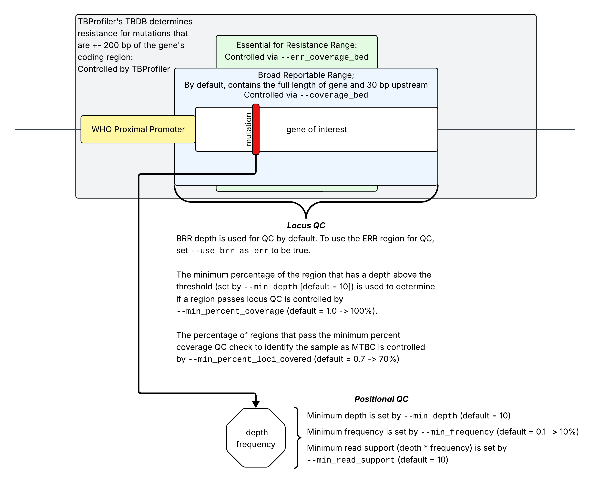

## Required Inputs

`tbp-parser` is designed to run immediately after [Jody Phelan’s TBProfiler tool](https://github.com/jodyphelan/TBProfiler). Only three inputs are required: the JSON file produced by `TBProfiler` and the BAM and BAI file produced by `TBProfiler`.

| Parameter  | Description | Purpose |
| :--------- | :---------- | :------ |
| input_json | The path to the JSON file that was produced by `TBProfiler` v6+ |Contains information about the mutations detected in the sample: quality, type, and any antimicrobial resistance information. |
| input_bam  | The path to the BAM file that was produced by `TBProfiler` v6+. The associated BAI must be in the same directory. | Contains the alignment information for the sample; needed for determining sequencing quality for quality control. |

## Optional Inputs

`tbp-parser` can be customized with a number of optional input parameters. These parameters control:

- files that contain information about the genes of interest and their associated antimicrobials
- files that control the LIMS output report formatting
- quality control thresholds
- text in the output reports (column names, sequencing method, etc.)

??? caption "Click to show a diagram depicting various input parameter interaction"
    

### File Arguments

A description of each file follows the table.

| Name | Description | Default Value |
| :------------ | :---------- | :------------ |
| `--config` | the configuration files to use, in YAML format. This argument overrides all other arguments EXCEPT for the other file-type arguments. | |
| `-b`, `--coverage_bed` | the BED file containing the genes of interest, their locus tags, their associated antimicrobial, and their regions for QC calculations; should be formatted like the TBDB.bed file in TBProfiler | [/data/tbdb.bed](https://github.com/theiagen/tbp-parser/blob/main/tbp_parser/data/tbdb.bed) |
| `--lims_report_format_yml` | an optional YAML file that specifies the format of the LIMS report; if not provided, a default format will be used | [/data/default-lims-report-format.yml](https://github.com/theiagen/tbp-parser/blob/main/tbp_parser/data/default-lims-report-format.yml) |
| `--gene_database_yml` | an optional YAML file that specifies the gene database information for the genes of interest; if not provided, a default format will be used | [/data/default-gene-database_2026-03-03.yml](https://github.com/theiagen/tbp-parser/blob/main/tbp_parser/data/default-gene-database_2026-03-03.yml) |

#### Configuration File

Instead of providing the input parameters on the command line, the ability to provide a configuration file in YAML format is available. This file (and any included fields) are **case-sensitive**.

The configuration file will **overwrite all command-line arguments**, except for other file arguments. The configuration file can be provided using the `--config` argument. Input parameters should be indicated in all caps and should match the long version of the command-line arguments (e.g. `MIN_FREQUENCY` instead of `-f` or `--min_frequency`).

To overwrite any output text, please use the find and replace variable in the configuration file.

```yaml
# I can overwrite any input parameters, like so. 
# This makes it easy to rerun the same analysis on different 
#  samples without rewriting all of the parameters each time.
MIN_FREQUENCY: 0.1
MIN_PERCENT_LOCI_COVERED: 0.7
TNGS: true
RESOLVE_OVERLAPPING_REGIONS: true
TNGS_FREQUENCY_BOUNDARIES:
- 0.1
- 0.95
TNGS_READ_SUPPORT_BOUNDARIES:
- 100
- 500

# I can also use the configuration file to customize output files.
# My laboratory reports "rifampicin" as "rifampin", so I want to
#  rename that text in all of the output files. I also use Rv0678
#  instead of mmpR5 and Rv2983 instead of fbiD; and I need to rename 
#  an output column in the LIMS report from "Sample Name" to "sample"
FIND_AND_REPLACE:
  rifampicin: "rifampin"
  fbiD: "Rv2983"
  mmpR5: "Rv0678"
  "Sample Name": "sample"


```

#### Coverage BED File

The Coverage BED file is the **tab-delimited** [BED](https://grch37.ensembl.org/info/website/upload/bed.html) file that contains gene regions of interest and their associated antimicrobials. This file is used for quality control calculations. The file should be formatted like the genes.bed file in TBProfiler, with the following columns in this order:

1. `chrom`: the chromosome or contig name which must match the chromosome name in the BAM file (e.g. "Chromosome")
2. `start`: the start position of the gene (e.g. 1)
3. `end`: the end position of the gene (e.g. 1524)
4. `locus_name`: the locus name of the gene (e.g. "Rv0001")
5. `gene_name`: the gene name (e.g. "dnaA")

**Any other columns after the first 5 columns will be ignored**, but can be used to provide additional information about the gene (e.g. associated antimicrobials) for personal use. For example, the following is a valid BED file:

```text
Chromosome	1	1524	Rv0001	dnaA	isoniazid
Chromosome	4933	7267	Rv0005	gyrB	levofloxacin,moxifloxacin
...
```

Please note that this file *does not* have a header line. The default file used in tbp-parser was retrieved from [the TBProfiler repository here](https://github.com/jodyphelan/TBProfiler/blob/44ce9b5d361d44b811e212f575283d0ab43da2ed/db/tbdb/genes.bed) with commit hash `44ce9b5`.

This is the same format used for the optional `--err_coverage_bed` file, which is an optional input parameter primarily for tNGS analysis ([see below](#tngs-specific-arguments)).

#### LIMS Report Format YAML File

[Please see the LIMS report section for more information on this report and its purpose](outputs/lims.md).

Different LIMS systems may require different column formatting for easy import. The LIMS report format YAML file allows users to specify the output column names for the LIMS report output. If this file is not provided, [a default format will be used](https://github.com/theiagen/tbp-parser/blob/main/data/default-lims-report-format.yml). This default includes all gene-drug combinations found in the default Coverage bed file, described above.

The output column names can be customized to contain any text according to your laboratory's needs by providing a custom `lims_report_format_yml` file, which should take the following format:

```yaml
# do not modify unbracketed text
# <this text can be fully customized>
# [this text must match TBProfiler nomenclature for drug and gene names]

- drug: [drug_name]
  drug_code: <antimicrobial_column_name_in_lims_report>
  gene_codes:
    [gene_name]: <column_name_for_gene_drug_combo_in_lims_report> 
    [gene_name]: <column_name_for_gene_drug_combo_in_lims_report>
    ...
- drug: [drug_name]
  drug_code: <antimicrobial_column_name_in_lims_report>
  gene_codes: {}
...
```

- `drug_name` is the name of the drug **as it appears in TBProfiler** (for example, "rifampicin").
- `gene_name` is the name of the gene **as it appears in TBProfiler** (for example, "rpoB").
- `antimicrobial_column_name_in_lims_report` is the **desired name of the output column** in the LIMS report that indicates the highest resistance interpretation for that drug (for example, "RIF").
- `column_name_for_gene_drug_combo_in_lims_report` is the **desired name of the output column** in the LIMS report that indicates any mutations found in that gene that are responsible for the predicted resistance for that drug (for example, "RIF_rpoB").

For example:

```yaml
- drug: rifampicin
  drug_code: RIF
  gene_codes:
    rpoB: RIF_rpoB
- drug: amikacin
  drug_code: AMK
  gene_codes:
    bacA: AMK_bacA
    ccsA: AMK_ccsA
    eis: AMK_eis
...
```

#### Gene Database File

tbp-parser also includes a *gene database* file that contains a dictionary of the following information for each gene:

1. `locus_tag`: the locus tag of the gene (e.g. `Rv0005`)
2. `gene_name`: the gene name (e.g. `gyrB`)
3. `tier`: the tier of the gene (e.g. `Tier 1`)
4. `promoter_region`: the WHO-specified proxmial promoter region (e.g. `[-108, -1]`)
5. `drugs`: the antimicrobials associated with this gene (e.g. `[levofloxacin, moxifloxacin]`)

By default, this database contains information for every gene in the default coverage BED file described above. If you would like to include a different gene, or modify the content of existing entries, you can do so by using the following format:

```yaml
# do not modify unbracketed text
# text within angle brackets should be replaced with the appropriate information for the gene of interest
<locus_tag_of_gene>:
  locus_tag: <locus_tag_of_gene>
  gene_name: <gene_name>
  tier: <tier_of_gene>
  promoter_region: [<WHO-specified_proximal_promoter_regions_start>, <WHO-specified_proximal_promoter_regions_end>]
  drugs: [<drug_1>, <drug_2>, ...]
<locus_tag_of_gene2>:
  ...
...
```

If information for your gene of interest is not available, please use the following values as placeholders:

- for `tier`, use `NA`
- for `promoter_region`, use `[]`

Content for the `locus_tag`, `gene_name`, and `drugs` fields is required for proper function.

For example, the following are valid entries in the gene database file:

```yaml
Rv0001:
    locus_tag: Rv0001
    gene_name: dnaA
    tier: NA
    promoter_region: [-314, -1]
    drugs: [isoniazid]
Rv0676c:
    locus_tag: Rv0676c
    gene_name: mmpL5
    tier: Tier 1
    promoter_region: []
    drugs: [bedaquiline, clofazimine]
```

### Quality Control Arguments

These options determine the thresholds for quality control.

| Short Version | Long Version           | Description | Default Value |
| :------------ | :--------------------- | :---------- | :------------ |
| `-d` | `--min_depth` | The minimum depth of coverage required for a site to pass QC | 10 |
| `-c` | `--min_percent_coverage` | The minimum percentage of a region that has depth above the threshold set by `min_depth` (used for a gene/locus to pass QC; 1.0 -> 100%) | 1.0 |
| `-s` | `--min_read_support` | The minimum read support for a mutation to pass QC | 10 |
| `-f` | `--min_frequency` | The minimum frequency for a mutation to pass QC (0.1 -> 10%) | 0.1 |
| `-l` | `--min_percent_loci_covered` | The minimum percentage of loci/genes in the LIMS report that must pass coverage QC for the sample to be identified as MTBC (0.7 -> 70%) | 0.7 |

### Text Arguments

These options are used verbatim in the reports, or are used to name the output files.

| Short Version | Long Version | Description | Default Value |
| :--- | :--- | :---------- | :------------ |
| `-m` | `--sequencing_method` | The sequencing method used to gerneate the data; used in the LIMS & Looker reports. Enclose in quotes if including a space | "Sequencing method not provided" |
| `-t` | `--operator` | The operator who ran the analysis; used in the LIMS & Looker reports. Enclose in quotes if including a space | "Operator not provided" |
| `-o` | `--output_prefix` | The prefix to use for the output files. Do not include any spaces | "tbp_parser" |
| `-fr` | `--find_and_replace` | A JSON string that can be used to specify any text in the output files that should be find-and-replaced with other text. The keys will be the text to find, and the values will be the text to replace it with. This is useful for labs that want to customize the text in their reports (e.g. renaming drugs or genes or output columns).<br>For example, `'{"rifampicin": "rifampin", "Sample Name": "sample_id", "mmpR5": "Rv0678"}'` | '{}' |

### tNGS-specific Arguments

These options are primarily used for tNGS data.

| Name | Description | Default Value |
| :--- | :---------- | :------------ |
| `--tngs` | Indicates that the input data was generated using a tNGS protocol. Turns on tNGS-specific features | false |
| `-e`, `--err_coverage_bed` | the BED file containing the "essential for resistance regions." This file indicates to tbp-parser that these regions should also have breadth of coverage and average depth calculations performed; this file should be formatted like the genes.bed file in TBProfiler and the [coverage BED described above](#coverage-bed-file) | |
| `--use_err_as_brr` | if an ERR BED file is provided, use the ERR regions in place of the typical coverage regions for all QC calculations<br>Note: this is an experimental option | |
| `--resolve_overlapping_regions` | Resolve overlapping BED regions to avoid double-counting reads across overlapping targets. Recommended for tNGS data with overlapping amplicon regions. See [Handling overlapping primer regions](../algorithm/technical.md) for details | false |
| `--tngs_frequency_boundaries` | the frequency boundaries (comma-delimited; `lower_f,upper_f`) for tNGS QC reporting, used in conjunction with `--tngs_read_support_boundaries` | 0.1,0.1 |
| `--tngs_read_support_boundaries` | the read support boundaries (comma-delimited; `lower_r,upper_r`) for tNGS QC reporting, used in conjunction with `--tngs_frequency_boundaries` | 10,10 |

### Logging Arguments

These options change the verbosity of the `stdout` log.

| Name | Description | Default Value |
| :--- | :---------- | :------------ |
| `--debug` | The highest level of output verbosity detailing every step of the analysis and logic implemented; overwrites --verbose | false |
