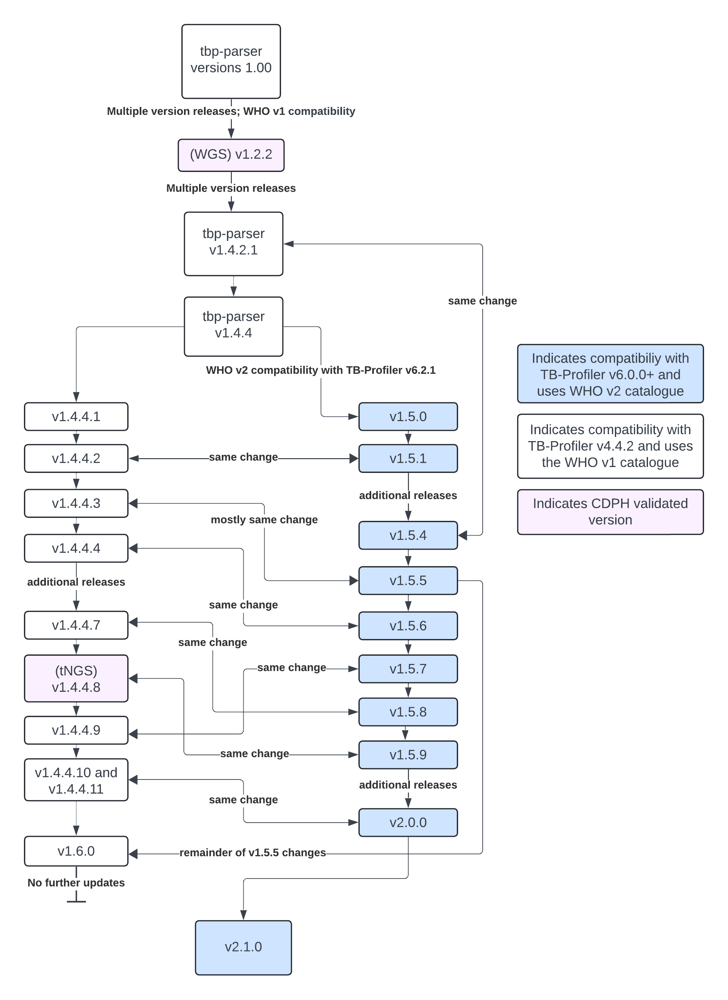

The following is a list of every version of `tbp-parser` and a short summary of the changes made in each version.

Blue indicates that CDPH performed a clinical validation on that version

- v1.0.0 - initial version
- v1.1.0 - adjusts the highest interpretation for a drug to only consider genes in LIMS report, adds the rule to the confidence column, adds QRDR expert rules for gyrA and gyrB
- v1.1.1 - fixes a bug in R/QRDR region calculations
- v1.1.2 - adjusts LIMS lineage designation by checking for BCG and if lineage from TB Profiler is empty
- v1.1.3 - now includes the TB Profiler sublineage output when determining BCG M bovis
- v1.1.4 - now checks if multiple lineages/sublineages were detected
- v1.1.5 - checks all mmpS/mmpL/mmpR alternate consequences; also checks to make sure all drugs are reported
- v1.1.5.1 - renames rifampicin to rifampin
- v1.1.6 - removes a locus warning with deletion caveat
- v1.1.7 - ensures all deletion caveat locus warnings are gone, overwrites all fields with locus warning with “NA” or “Insufficient Coverage” as appropriate and moves them to the bottom of the Laboratorian report
- v1.1.8 - changes overwrite to only overwrite interpretation values, not mutation information
- v1.1.9 - renames rifampicin to rifampin
- v1.2.0 - enables ability to provide alternate coverage bed file; introduced the modified regions (just coding region + 30bp upstream or promoter region)
- v1.2.1 - fixes a bug when renaming rifampicin to rifampin
- **v1.2.2 (WGS)** - improve how maximum MDL interpretation is calculated for the LIMS report. *Use the smw-tb-2024-01-16-dev branch on Terra.*
- v1.2.3 - check only the LIMS genes’ coverage for LIMS lineage determination and use a threshold for all lineage designation
- v1.3.0 - adds tNGS regions, checks to make sure that only variants for genes in the coverage report are included in the laboratorian (tNGS), error-proof locus tag designation, add check to prevent failures when gene not in coverage dictionary (tNGS), adds “NA” to the mutation rank list (score = 0, same as Insufficient Coverage)
- v1.3.1 - adds `--tngs` flag to turn on tNGS-specific global parameters, establishes different threshold calculation for lineage designation for tNGS, checks the segment of a gene a variant was detected in, removes check that did not prevent failures when gene not in coverage dictionary from v1.3.0, error-proof all coverage checks, adds “This mutation is outside the expected region” warning
- v1.3.2 - error-proofs coverage warning and adds additional section for tNGS gene segments, error-proofs gene tier for tNGS gene segments
- v1.3.3 - condenses most gene segments into one, for WT mutations, set the mutation to “WT” not “NA”
- v1.3.4 - error-proofs maximum mdl interpretation determination and maximum looker interpretation determination
- v1.3.5 - adds rrs & rrl frequency input parameters to customize mutation frequency for those genes , overwrites gene MDL interpretation when “Insufficient Coverage” to act as if “WT” if greater than S
- v1.3.6 - adds the TBProfiler lineage to the end of the LIMS report and the Looker report, adds LIMS lineage to Looker report, introduces check if max MDL interpretation is also Insufficient Coverage to change output to Pending Retest
- v1.3.7 - add to the coverage report the “expert rule regions” column for tNGS, overwrites gene MDL interpretation when “Insufficient Coverage” to act as if “WT” if gr ****eater than *or equal to* S
- v1.3.8 - add frequency input parameters for rpoB 449 and ethA 237, renames coverage threshold to minimum percent coverage
- v1.3.9 - check if gene name is rpoB because that means it’s outside the expected region (tNGS - rpoB is in two segments), add rrs and rrl read support input parameters
- v1.4.0 - rework how QC is performed (order of operations)
- v1.4.1 - remove rpoB expected region check, implements deletion position quality check in QC (keep only valid deletions), if outside expected region warning, set MDL interpretations to NA
- v1.4.2 - remove “outside expected region” mutations from LIMS report, error-proofs determining responsible MDL interpretations
- v1.4.2.1 (same change in v1.5.4) - prevent overwriting “R” mutations with No Sequence, and overwrite “U” mutations with “Pending Retest” if bad quality
- v1.4.3 - implement different thresholds for LIMS lineage identification for tNGS,
- v1.4.4 - update expert rule interpretations (mainly S → U in several spots)
- v1.4.4.1 (v1.5.0 branched off of this one)- update LIMS threshold to 90, not the coverage threshold
- v1.4.4.2 (same change in v1.5.1) - fix an issue where “No sequence” was not triggering Pending Retest
- v1.4.4.3 (same change in v1.5.5) - fix an issue where “Pending Retest” was not properly appearing
- v1.4.4.4 (same change in v1.5.6) - prevent “Pending Retest” if Insufficient Coverage is in a gene that also has a valid deletion
- v1.4.4.5 - consider deletions invalid if coverage is between 0 and minimum coverage (10 default) (this consideration is unique to old TB Profiler and not mimicked in v1.5)
- v1.4.4.6 - a mistake; updates the version (this release is a mystery to me as there is nothing in there except version update)
- v1.4.4.7 (same change in v1.5.8) - change tNGS LIMS lineage designation to items in the coverage dictionary (to represent both rpoB segments)
- **v1.4.4.8 (tNGS)** (same change in v1.5.9)- reduce tNGS LIMS threshold to 70% from 90. *Use the smw-tb-2024-05-03-dev branch on Terra for this and all subsequent v1.4.4.x+ versions.*
- v1.4.4.9 (same change in v1.5.7) - add optional input to add cycloserine to LIMS report
- v1.4.4.10 - fix issue when MDL resistance was being overwritten to Pending Retest but without considering other genes when calculating the highest MDL resistance (as the other genes may have had higher resistances that were not captured at first)
- v1.4.4.11 - fix issue introduced by last fix where we ran into indexing errors due to no more MDL interpretations available in the list
- v1.5.0 (branched off of v1.4.4.1)- make all language changes necessary to be compatible with TBProfiler v6.2.1. *Use the smw-tb-2024-05-03-who2-dev branch on Terra for this and all subsequent v1.5.x+ versions.*
- v1.5.1  (same change in v1.4.4.2)- fix an issue where “No sequence” was not triggering Pending Retest
- v1.5.2 - a mistake; somehow exactly the same as 1.4.4.2?? (this release is also a mystery)
- v1.5.3 - make additional language changes and fix an unusual edge case where the same mutation was identified; rename mmpR5 to Rv0678 again
- v1.5.4 (same change in v1.4.2.1) - prevent overwriting “R” mutations with No Sequence
- v1.5.5 (same change in v1.4.4.3) - fix an issue where “Pending Retest” was not properly appearing; consider only LIMS genes for LIMS reort
- v1.5.6 (same change in v1.4.4.4) - prevent “Pending Retest” if Insufficient Coverage is in a gene that also has a valid deletion
- v1.5.7 (same change in v1.4.4.9) - add optional input to add cycloserine to LIMS report
- v1.5.8 (same change in v1.4.4.7) - change tNGS LIMS lineage designation to check items in the coverage dictionary (to represent both rpoB segments; percentage calculation erroneously combined them)
- v1.5.9 (same change in v1.4.4.8) - reduce tNGS LIMS threshold to 70% from 90
- v1.5.10 - correct spelling of two genes in the LIMS report for cycloserine
- v1.6.0 (branched off of v1.4.4.11) - ensures that only LIMS genes are being considered for the LIMS report. *Use the smw-tb-2024-05-03-dev branch on Terra for this and all subsequent v1.6.x+ versions.*
- v2.0.0 (branched off of v1.5.10; same change in v1.4.4.10 and v1.4.4.11) - fix issue when MDL resistance was being overwritten to Pending Retest but without considering other genes when calculating the highest MDL resistance (as the other genes may have had higher resistances that were not captured at first) and fixes the resulting issue where indexing errors occurred due to no more MDL interpretations. *Use the smw-tb-2024-05-03-who2-dev branch on Terra for this and all subsequent v2.x+ versions.*
- v2.1.0 - any mutations in the 60 proximal promoter regions included in the WHO v2 database (Table 22, page 89-90). *Use either the smw-tbprofiler-updates-dev branch until the time of the v2.3.0 release of TheiaProk on Terra for this and all subsequent v2.1.x+ versions*
    - Earlier versions are now deprecated and will no longer be supported.
- v2.1.1 - adds the source and comment fields from TBDB to the Laboratorian report; fixes a bug where mmpR5 was not being completly renamed to Rv0678; fixes a bug where mutations that didn't share the same position were being compared
- v2.2.0 - removes ciprofloxacin, fluoroquinolones, and ofloxacin from gyrA and gyrB and aminoglycosides from rrs in the `globals.GENE_TO_ANTIMICROBIAL_DRUG_NAME` dictionary; if a drug is missing in the TBProfiler JSON's gene_associated_drug field that is present in that global dictionary, it will be added for the mutation.
- v2.2.1 - fixes a bug where rifampicin was not renamed to rifampin, which caused duplicate lines to appear in the Laboratorian report.
- v2.2.2 - removes the high-level and low-level resistance comments from the LIMS report
- v2.3.0 - reworks the lineage detection so that if TBProfiler detects a lineage, it is reported; if no lineage is reported by TBProfiler, then whether or not M.tb was detected depends on the percentage of LIMS genes above a (now lower) default percentage of 0.7; all pytests have been fixed as well
- v2.4.0 - enables ability to provide a configuration file that will overwrite all command-line parameters. This is useful for tNGS assays when you use different primer assays can target only some genes, and not others.
- v2.4.1 - cleans up some code and updates the DockerFile to build properly
- v2.4.2 - ensures that mutations that are not found in WHO catalogue are run through the expert rules
- v2.4.3 - fixes a typo in Row.py, "No WHO confidence" should be "No WHO annotation". Fixes empty M_DST_E02_pncA column on LIMS report.
- v2.4.4 - fixes default file paths for --coverage_regions and --tngs-expert-regions.
- v2.4.5 - fixes the data type of the --min_percent_coverage (COVERAGE_THRESHOLD) variable to be a float rather than an int
- v2.5.0 - alters changes made in v2.3.0 so that the 70% coverage threshold is used for WGS lineage detection regardless if TBProfiler detects a lineage or not; reworks the extract alternative consequences function so that the parent interpretation is not inherited and is regenerated for that specific mutation
- v2.5.1 - prevents inheritance of parent comment when parsing alternative consequences
- v2.6.0 - only applies the "mutation outside the expected region" warning when --tngs is true, and the LIMS report now only shows the amino acid change unless amino acid chnages did not occur, in which case the nuclotide change is shown

---

The following diagram shows how each version is related to the others without technical details:
{ align = left }
